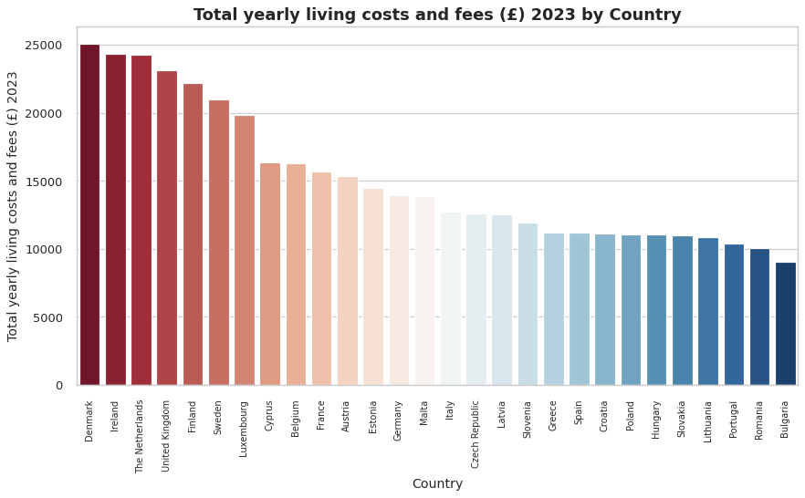

# Total-yearly-living-costs-and-fees-2023-by-Country-in-Europe
## Overview
El presente data frame nos muestra el costo de vivir en paises Europeos en el 2023 inluido impuestos. Esto nos puede dar una vista general de a que paises podrian migrar estudiantes entusiasmados por llevar carreras de pregrado o posgrado de LATAM, guiados por el presupuesto que manejen.

| Objetivos | Descripción|
| ----------- | ----------- |
| Propósito de la tarea | Usa Python para crear una visualización informativa y placentera a la vista |
| Los datos | - First item - Total yearly living costs and fees (£) - Average yearly tuition fees (£) - Yearly student living costs (£) |
| La visualización | Presentamos una visuliazación tipo grafico de barras ordenado desde el pais más costoso al menos costoso que nos otorga una introducción a la información directa|
| Gráfico de barras | |
